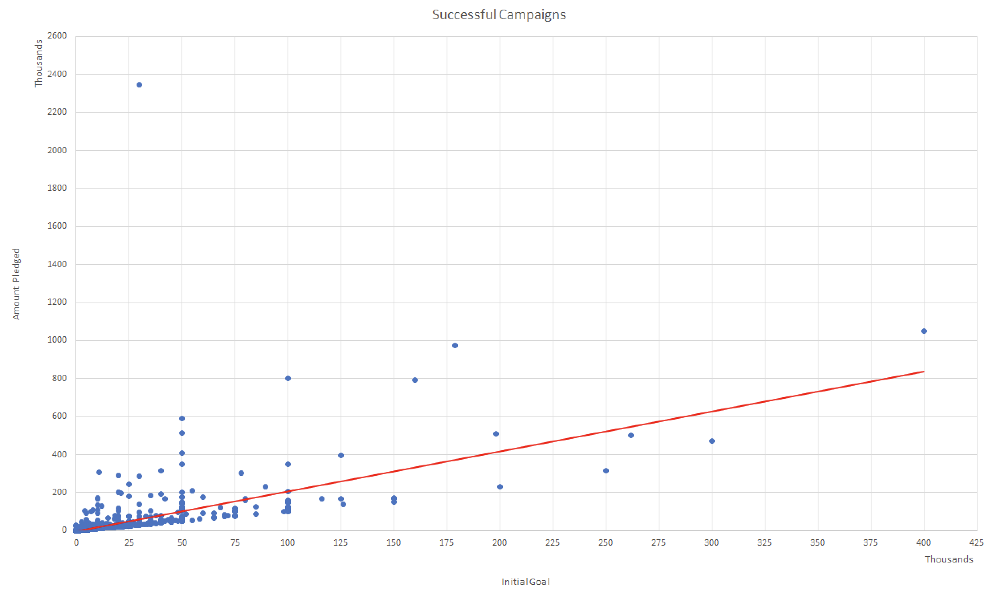

# Excel Kickstart My Chart

## Background

Over $2 billion has been raised using the massively successful crowdfunding service, Kickstarter, but not every project has found success. Of the more than 300,000 projects launched on Kickstarter, only a third have made it through the funding process with a positive outcome.\

Getting funded on Kickstarter requires meeting or exceeding the project's initial goal, so many organizations spend months looking through past projects in an attempt to discover some trick for finding success. For this week's homework, you will organize and analyze a database of 4,000 past projects in order to uncover any hidden trends.\

## Preliminary Analysis

We started with a dataset of 4,000 projects, and created additional features to include, "Percent Funded" and "Average Donation". The "Category and Sub-Category" feature was also divided into two, separate columns labeled, "Category" and "Sub-Category", to more accurately define the results in later analyses. Next, we conducted exploratory data analysis to quickly identify any trends by color coding the outcome and percentage funded categories.

- - -

- - -

- - -

- - -

